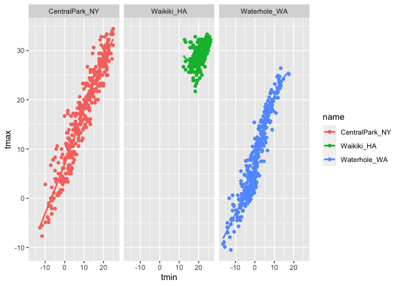
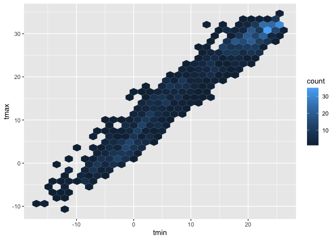
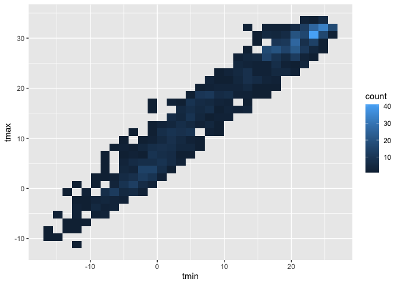
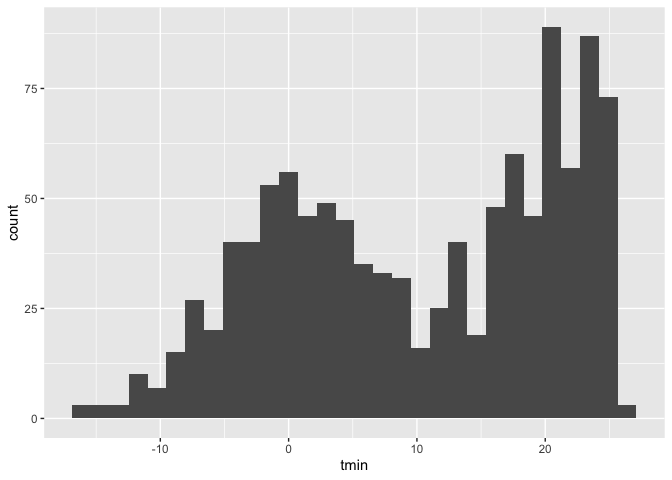
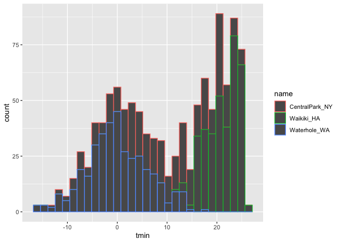
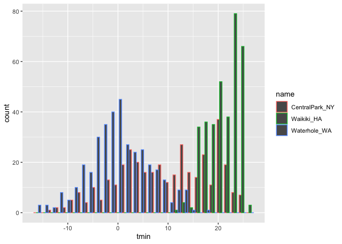
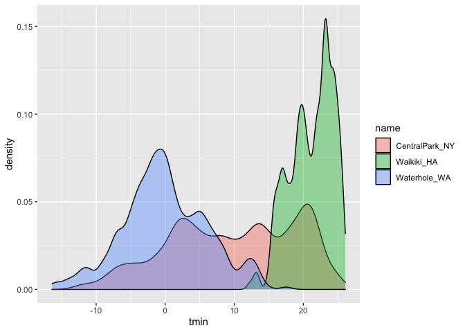
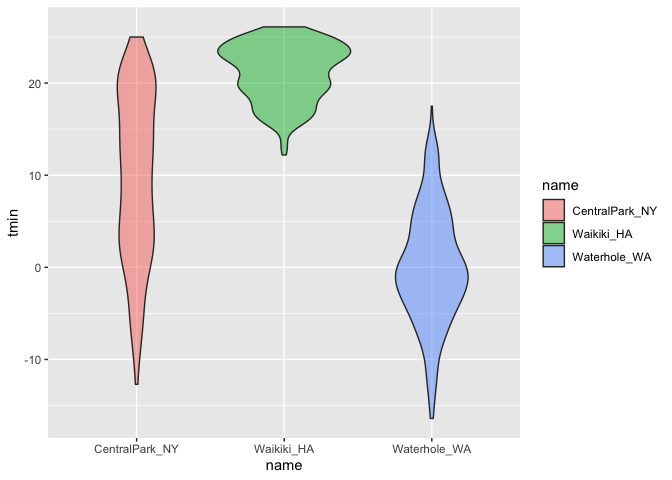

Visualization
================
2022-09-29

``` r
library(tidyverse)
```

    ## ── Attaching packages ─────────────────────────────────────── tidyverse 1.3.2 ──
    ## ✔ ggplot2 3.3.6      ✔ purrr   0.3.4 
    ## ✔ tibble  3.1.8      ✔ dplyr   1.0.10
    ## ✔ tidyr   1.2.0      ✔ stringr 1.4.1 
    ## ✔ readr   2.1.2      ✔ forcats 0.5.2 
    ## ── Conflicts ────────────────────────────────────────── tidyverse_conflicts() ──
    ## ✖ dplyr::filter() masks stats::filter()
    ## ✖ dplyr::lag()    masks stats::lag()

``` r
library(ggridges)
```

## Load the weather data

Creating a data frame using the `meteo_pull_monitors` in `rnoaa` (allows
you to access public data online that is aggregated); using this to pull
data rather than creating it ourselves or reading a CSV

``` r
weather_df <- 
  rnoaa::meteo_pull_monitors(
    c("USW00094728", "USC00519397", "USS0023B17S"),
    var = c("PRCP", "TMIN", "TMAX"), 
    date_min = "2017-01-01",
    date_max = "2017-12-31") %>%
  mutate(
    name = recode(
      id, 
      USW00094728 = "CentralPark_NY", 
      USC00519397 = "Waikiki_HA",
      USS0023B17S = "Waterhole_WA"),
    tmin = tmin / 10,
    tmax = tmax / 10) %>%
  select(name, id, everything())
```

    ## Registered S3 method overwritten by 'hoardr':
    ##   method           from
    ##   print.cache_info httr

    ## using cached file: ~/Library/Caches/R/noaa_ghcnd/USW00094728.dly

    ## date created (size, mb): 2022-09-29 11:01:00 (8.401)

    ## file min/max dates: 1869-01-01 / 2022-09-30

    ## using cached file: ~/Library/Caches/R/noaa_ghcnd/USC00519397.dly

    ## date created (size, mb): 2022-09-29 11:01:06 (1.699)

    ## file min/max dates: 1965-01-01 / 2020-03-31

    ## using cached file: ~/Library/Caches/R/noaa_ghcnd/USS0023B17S.dly

    ## date created (size, mb): 2022-09-29 11:01:09 (0.95)

    ## file min/max dates: 1999-09-01 / 2022-09-30

``` r
weather_df
```

    ## # A tibble: 1,095 × 6
    ##    name           id          date        prcp  tmax  tmin
    ##    <chr>          <chr>       <date>     <dbl> <dbl> <dbl>
    ##  1 CentralPark_NY USW00094728 2017-01-01     0   8.9   4.4
    ##  2 CentralPark_NY USW00094728 2017-01-02    53   5     2.8
    ##  3 CentralPark_NY USW00094728 2017-01-03   147   6.1   3.9
    ##  4 CentralPark_NY USW00094728 2017-01-04     0  11.1   1.1
    ##  5 CentralPark_NY USW00094728 2017-01-05     0   1.1  -2.7
    ##  6 CentralPark_NY USW00094728 2017-01-06    13   0.6  -3.8
    ##  7 CentralPark_NY USW00094728 2017-01-07    81  -3.2  -6.6
    ##  8 CentralPark_NY USW00094728 2017-01-08     0  -3.8  -8.8
    ##  9 CentralPark_NY USW00094728 2017-01-09     0  -4.9  -9.9
    ## 10 CentralPark_NY USW00094728 2017-01-10     0   7.8  -6  
    ## # … with 1,085 more rows

## Scatterplots!!

Create my first scatterplot ever.

``` r
ggplot(weather_df, aes(x = tmin, y = tmax)) + 
  geom_point()
```

    ## Warning: Removed 15 rows containing missing values (geom_point).

<!-- -->

New approach, same plot: Piping

``` r
weather_df %>% 
  ggplot(aes(x = tmin, y = tmax)) +
  geom_point()
```

    ## Warning: Removed 15 rows containing missing values (geom_point).

<!-- -->

Can also add mutate, filter, or select –\> can do data manipulation
before you make the plot, but all in a row

Save and edit a plot object.

``` r
weather_plot <-
  weather_df %>% 
  ggplot(aes(x = tmin, y = tmax))

weather_plot
```

<!-- -->

``` r
#can treat this like an existing plot that you can add to.

weather_plot + geom_point()
```

    ## Warning: Removed 15 rows containing missing values (geom_point).

<!-- -->

## Advanced scatterplot…

#### Start with the same one and make it fancy

``` r
weather_df %>% 
  ggplot(aes(x = tmin, y = tmax, color = name)) +
  geom_point() +
  geom_smooth(se = FALSE)
```

    ## `geom_smooth()` using method = 'loess' and formula 'y ~ x'

    ## Warning: Removed 15 rows containing non-finite values (stat_smooth).

    ## Warning: Removed 15 rows containing missing values (geom_point).

<!-- -->

Smooth curves that run through the middle of the dataset. Helpful to
know that `geom_smooth` is additional geometry you can add when you’re
exploring your data.

#### What about the `aes` placement..?

Can specify some aesthetics within geom_point. It ends up looking the
same

``` r
weather_df %>% 
  ggplot(aes(x = tmin, y = tmax)) +
  geom_point(aes(color = name)) +
  geom_smooth()
```

    ## `geom_smooth()` using method = 'gam' and formula 'y ~ s(x, bs = "cs")'

    ## Warning: Removed 15 rows containing non-finite values (stat_smooth).

    ## Warning: Removed 15 rows containing missing values (geom_point).

<!-- --> Instead of
having one line for each `name`, we just have a sinngle blue line that
runs through the data. Reason for that is because color is only applied
to the scatterplot when it was defined within the `geom_point` argument.

Be aware that you can define aesthetics in ggplot, which makes it global
and will be passed through everything else.

#### Let’s facet some things!!

``` r
weather_df %>% 
  ggplot(aes(x = tmin, y = tmax, color = name)) +
  geom_point() +
  geom_smooth(se = FALSE) + 
  facet_grid(. ~ name)
```

    ## `geom_smooth()` using method = 'loess' and formula 'y ~ x'

    ## Warning: Removed 15 rows containing non-finite values (stat_smooth).

    ## Warning: Removed 15 rows containing missing values (geom_point).

<!-- -->

First argument defines rows \~ second argument defines columns. Creates
three paneled plot with smooth curves.

#### Adjusting the alpha level and the transparency:

``` r
weather_df %>% 
  ggplot(aes(x = tmin, y = tmax, color = name)) +
  geom_point(alpha = .2) +
  geom_smooth(se = FALSE, size = 1) + 
  facet_grid(. ~ name)
```

    ## `geom_smooth()` using method = 'loess' and formula 'y ~ x'

    ## Warning: Removed 15 rows containing non-finite values (stat_smooth).

    ## Warning: Removed 15 rows containing missing values (geom_point).

<!-- --> Defining
aesthetics related to specific variables

-   alpha = .5 \> 50% transparency
    -   If you define alpha outside of the aesthetic, meaning not
        applying it to a variable, you can define it globally by
        including it in another function (using geom_point like shown
        here rather than using ggplot function alpha = tmin or
        something)

#### Let’s combine some elements and try a new plot.

``` r
weather_df %>% 
  ggplot(aes(x = date, y = tmax, color = name)) + 
  geom_point(aes(size = prcp), alpha = 0.5) + 
  geom_smooth(se = FALSE) +
  facet_grid(. ~ name)
```

    ## `geom_smooth()` using method = 'loess' and formula 'y ~ x'

    ## Warning: Removed 3 rows containing non-finite values (stat_smooth).

    ## Warning: Removed 3 rows containing missing values (geom_point).

<!-- -->

## Some small notes

How many geoms have to exist?

You can have whatever geoms you want.

``` r
weather_df %>% 
  ggplot(aes(x = tmin, y = tmax, color = name)) +
  geom_smooth(se = FALSE)
```

    ## `geom_smooth()` using method = 'loess' and formula 'y ~ x'

    ## Warning: Removed 15 rows containing non-finite values (stat_smooth).

<!-- -->

You can use a neat geom!

``` r
# Hexagons
weather_df %>%
  ggplot(aes(x = tmin, y = tmax)) + 
  geom_hex()
```

    ## Warning: Removed 15 rows containing non-finite values (stat_binhex).

<!-- -->

``` r
# Squares
weather_df %>%
  ggplot(aes(x = tmin, y = tmax)) + 
  geom_bin2d()
```

    ## Warning: Removed 15 rows containing non-finite values (stat_bin2d).

<!-- -->

``` r
# Like an elevation map
weather_df %>%
  ggplot(aes(x = tmin, y = tmax)) + 
  geom_density2d() +
  geom_point(alpha = 0.3)
```

    ## Warning: Removed 15 rows containing non-finite values (stat_density2d).

    ## Warning: Removed 15 rows containing missing values (geom_point).

<!-- -->

Helpful when you have a plot that shows a LOT of data points and you
want to emphasize certain things

## Univariate plots

Histograms are really great.

``` r
weather_df %>% 
  ggplot(aes(x = tmin)) +
  geom_histogram()
```

    ## `stat_bin()` using `bins = 30`. Pick better value with `binwidth`.

    ## Warning: Removed 15 rows containing non-finite values (stat_bin).

<!-- -->

Can we add color …

``` r
weather_df %>% 
  ggplot(aes(x = tmin, color = name)) +
  geom_histogram()
```

    ## `stat_bin()` using `bins = 30`. Pick better value with `binwidth`.

    ## Warning: Removed 15 rows containing non-finite values (stat_bin).

<!-- -->

``` r
# Solves position argument (not overlapping)
weather_df %>% 
  ggplot(aes(x = tmin, color = name)) +
  geom_histogram(position = "dodge")
```

    ## `stat_bin()` using `bins = 30`. Pick better value with `binwidth`.

    ## Warning: Removed 15 rows containing non-finite values (stat_bin).

<!-- -->

``` r
# Filling bars
weather_df %>% 
  ggplot(aes(x = tmin, fill = name)) +
  geom_histogram(position = "dodge")
```

    ## `stat_bin()` using `bins = 30`. Pick better value with `binwidth`.

    ## Warning: Removed 15 rows containing non-finite values (stat_bin).

<!-- -->

``` r
# Could do one at a time by faceting
weather_df %>% 
  ggplot(aes(x = tmin, fill = name)) +
  geom_histogram() +
  facet_grid(. ~ name)
```

    ## `stat_bin()` using `bins = 30`. Pick better value with `binwidth`.

    ## Warning: Removed 15 rows containing non-finite values (stat_bin).

<!-- -->

``` r
# Removing fill argument; don't necessarily need to color whenn faceting
weather_df %>% 
  ggplot(aes(x = tmin)) +
  geom_histogram() +
  facet_grid(. ~ name)
```

    ## `stat_bin()` using `bins = 30`. Pick better value with `binwidth`.

    ## Warning: Removed 15 rows containing non-finite values (stat_bin).

<!-- -->

Use a different geometry if you don’t like it / want to compare
distributions across levels..

So, let’s try a new geometry!

``` r
weather_df %>% 
  ggplot(aes(x = tmin, fill = name)) +
  geom_density(alpha = 0.4, adjust = 0.5)
```

    ## Warning: Removed 15 rows containing non-finite values (stat_density).

<!-- -->

Density = histogram that’s been smoothed out around the edges. You do
lose a little bit of information. You can make some info come back if
you play with the bin width (adjust = 0.5).

This is just an exploration so no need to be perfect.

What about boxplots?

``` r
weather_df %>% 
  ggplot(aes(x = name, y = tmin)) +
  geom_boxplot()
```

    ## Warning: Removed 15 rows containing non-finite values (stat_boxplot).

<!-- -->

Trendy plots :-)

``` r
weather_df %>% 
  ggplot(aes(x = name, y = tmin, fill = name)) +
  geom_violin(alpha = 0.5)
```

    ## Warning: Removed 15 rows containing non-finite values (stat_ydensity).

<!-- -->

But this isn’t showing me the median.

``` r
weather_df %>% 
  ggplot(aes(x = name, y = tmin, fill = name)) +
  geom_violin(alpha = 0.5) +
  stat_summary(fun = "median")
```

    ## Warning: Removed 15 rows containing non-finite values (stat_ydensity).

    ## Warning: Removed 15 rows containing non-finite values (stat_summary).

    ## Warning: Removed 3 rows containing missing values (geom_segment).

<!-- -->

Ridge plots… the most popular plot of 2017

``` r
weather_df %>% 
  ggplot(aes(x = tmin, y = name)) +
  geom_density_ridges()
```

    ## Picking joint bandwidth of 1.67

    ## Warning: Removed 15 rows containing non-finite values (stat_density_ridges).

<!-- -->

## Save and Embed

Let’s save a scatterplot.

``` r
weather_plot <-
  weather_df %>% 
    ggplot(aes(x = tmin, y = tmax, color = name)) +
    geom_point(alpha = 0.5)

ggsave("results/weather_plot.pdf", weather_plot, width = 8, height = 5)
```

    ## Warning: Removed 15 rows containing missing values (geom_point).

What about embedding…

``` r
weather_plot
```

    ## Warning: Removed 15 rows containing missing values (geom_point).

<!-- -->

Embed at different size:

``` r
weather_plot
```

    ## Warning: Removed 15 rows containing missing values (geom_point).

<!-- -->

``` r
weather_plot
```

    ## Warning: Removed 15 rows containing missing values (geom_point).

<!-- -->

Want to avoid creating figures and axis labels where labels are too hard
to see.
