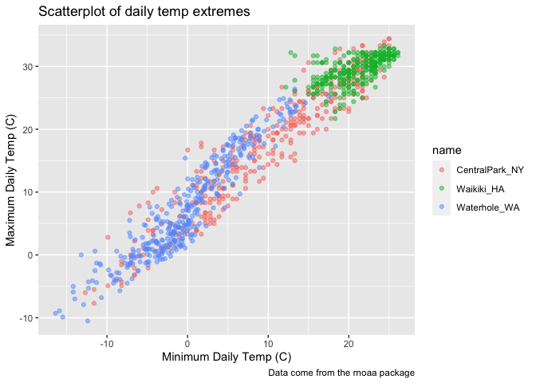
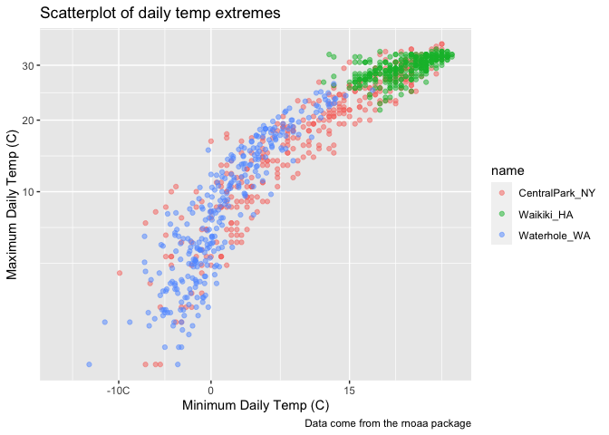
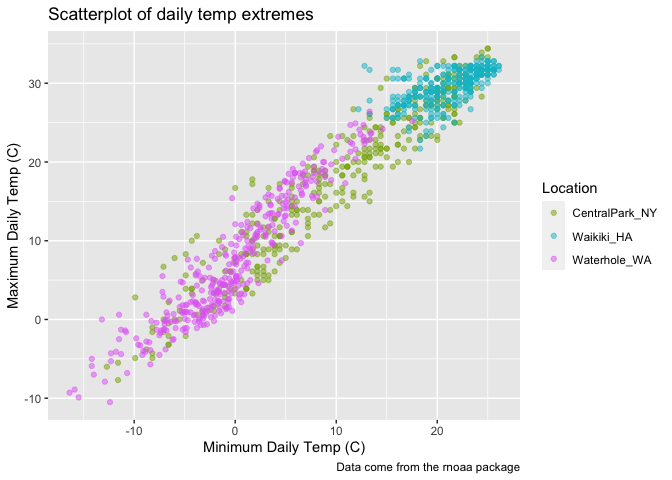
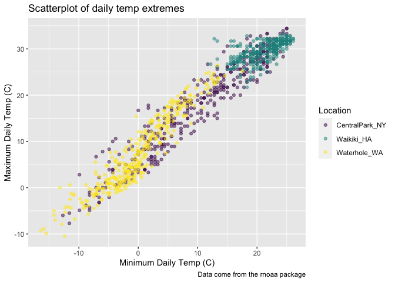

Visualization
================
2022-10-04

``` r
library(tidyverse)
```

    ## ── Attaching packages ─────────────────────────────────────── tidyverse 1.3.2 ──
    ## ✔ ggplot2 3.3.6      ✔ purrr   0.3.4 
    ## ✔ tibble  3.1.8      ✔ dplyr   1.0.10
    ## ✔ tidyr   1.2.0      ✔ stringr 1.4.1 
    ## ✔ readr   2.1.2      ✔ forcats 0.5.2 
    ## ── Conflicts ────────────────────────────────────────── tidyverse_conflicts() ──
    ## ✖ dplyr::filter() masks stats::filter()
    ## ✖ dplyr::lag()    masks stats::lag()

``` r
library(ggridges)
```

## Load the weather data

``` r
weather_df <- 
  rnoaa::meteo_pull_monitors(
    c("USW00094728", "USC00519397", "USS0023B17S"),
    var = c("PRCP", "TMIN", "TMAX"), 
    date_min = "2017-01-01",
    date_max = "2017-12-31") %>%
  mutate(
    name = recode(
      id, 
      USW00094728 = "CentralPark_NY", 
      USC00519397 = "Waikiki_HA",
      USS0023B17S = "Waterhole_WA"),
    tmin = tmin / 10,
    tmax = tmax / 10) %>%
  select(name, id, everything())
```

    ## Registered S3 method overwritten by 'hoardr':
    ##   method           from
    ##   print.cache_info httr

    ## using cached file: ~/Library/Caches/R/noaa_ghcnd/USW00094728.dly

    ## date created (size, mb): 2022-09-29 11:01:00 (8.401)

    ## file min/max dates: 1869-01-01 / 2022-09-30

    ## using cached file: ~/Library/Caches/R/noaa_ghcnd/USC00519397.dly

    ## date created (size, mb): 2022-09-29 11:01:06 (1.699)

    ## file min/max dates: 1965-01-01 / 2020-03-31

    ## using cached file: ~/Library/Caches/R/noaa_ghcnd/USS0023B17S.dly

    ## date created (size, mb): 2022-09-29 11:01:09 (0.95)

    ## file min/max dates: 1999-09-01 / 2022-09-30

## Scatterplot

But better this time

``` r
weather_df %>% 
  ggplot(aes(x = tmin, y = tmax, color = name)) + 
  geom_point(alpha = 0.5)
```

    ## Warning: Removed 15 rows containing missing values (geom_point).

<!-- -->

We want to tidy this up and add some features:

``` r
weather_df %>% 
  ggplot(aes(x = tmin, y = tmax, color = name)) + 
  geom_point(alpha = 0.5) +
  labs(
    x = "Minimum Daily Temp (C)",
    y = "Maximum Daily Temp (C)",
    title = "Scatterplot of daily temp extremes",
    caption = "Data come from the rnoaa package"
  )
```

    ## Warning: Removed 15 rows containing missing values (geom_point).

<!-- -->

Playing around with various scales – ggplot will make choices about the
mapping of the aesthetics, but that can be changed.

``` r
weather_df %>% 
  ggplot(aes(x = tmin, y = tmax, color = name)) + 
  geom_point(alpha = 0.5) +
  labs(
    x = "Minimum Daily Temp (C)",
    y = "Maximum Daily Temp (C)",
    title = "Scatterplot of daily temp extremes",
    caption = "Data come from the rnoaa package"
  ) +
  scale_x_continuous(
    breaks = c(-10, 0, 15),
    labels = c("-10C", "0", "15")
  ) + 
  scale_y_continuous(
    trans = "sqrt"
  )
```

    ## Warning in self$trans$transform(x): NaNs produced

    ## Warning: Transformation introduced infinite values in continuous y-axis

    ## Warning: Removed 90 rows containing missing values (geom_point).

<!-- -->

NOTE: Sqrt and log transformations can be helfpul to be able to do since
they come up

Make a new version:

``` r
weather_df %>% 
  ggplot(aes(x = tmin, y = tmax, color = name)) + 
  geom_point(alpha = 0.5) +
  labs(
    x = "Minimum Daily Temp (C)",
    y = "Maximum Daily Temp (C)",
    title = "Scatterplot of daily temp extremes",
    caption = "Data come from the rnoaa package"
  ) +
  scale_color_hue(
    name = "Location",
    h = c(100, 300))
```

    ## Warning: Removed 15 rows containing missing values (geom_point).

<!-- -->

Instead of using hue, use this:

``` r
weather_df %>% 
  ggplot(aes(x = tmin, y = tmax, color = name)) + 
  geom_point(alpha = 0.5) +
  labs(
    x = "Minimum Daily Temp (C)",
    y = "Maximum Daily Temp (C)",
    title = "Scatterplot of daily temp extremes",
    caption = "Data come from the rnoaa package"
  ) +
  viridis::scale_color_viridis(
    name = "Location",
    discrete = TRUE
  )
```

    ## Warning: Removed 15 rows containing missing values (geom_point).

<!-- -->

Viridis works great for people even if they have color blindness
