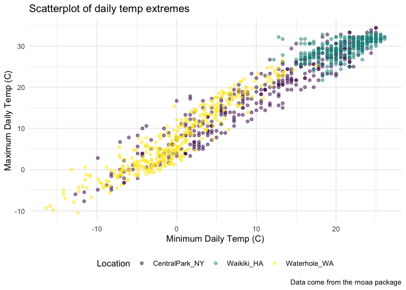

Visualization
================
2022-10-04

``` r
library(tidyverse)
```

    ## ── Attaching packages ─────────────────────────────────────── tidyverse 1.3.2 ──
    ## ✔ ggplot2 3.3.6      ✔ purrr   0.3.4 
    ## ✔ tibble  3.1.8      ✔ dplyr   1.0.10
    ## ✔ tidyr   1.2.0      ✔ stringr 1.4.1 
    ## ✔ readr   2.1.2      ✔ forcats 0.5.2 
    ## ── Conflicts ────────────────────────────────────────── tidyverse_conflicts() ──
    ## ✖ dplyr::filter() masks stats::filter()
    ## ✖ dplyr::lag()    masks stats::lag()

``` r
library(ggridges)
library(patchwork)
```

## Load the weather data

``` r
weather_df <- 
  rnoaa::meteo_pull_monitors(
    c("USW00094728", "USC00519397", "USS0023B17S"),
    var = c("PRCP", "TMIN", "TMAX"), 
    date_min = "2017-01-01",
    date_max = "2017-12-31") %>%
  mutate(
    name = recode(
      id, 
      USW00094728 = "CentralPark_NY", 
      USC00519397 = "Waikiki_HA",
      USS0023B17S = "Waterhole_WA"),
    tmin = tmin / 10,
    tmax = tmax / 10) %>%
  select(name, id, everything())
```

    ## Registered S3 method overwritten by 'hoardr':
    ##   method           from
    ##   print.cache_info httr

    ## using cached file: ~/Library/Caches/R/noaa_ghcnd/USW00094728.dly

    ## date created (size, mb): 2022-09-29 11:01:00 (8.401)

    ## file min/max dates: 1869-01-01 / 2022-09-30

    ## using cached file: ~/Library/Caches/R/noaa_ghcnd/USC00519397.dly

    ## date created (size, mb): 2022-09-29 11:01:06 (1.699)

    ## file min/max dates: 1965-01-01 / 2020-03-31

    ## using cached file: ~/Library/Caches/R/noaa_ghcnd/USS0023B17S.dly

    ## date created (size, mb): 2022-09-29 11:01:09 (0.95)

    ## file min/max dates: 1999-09-01 / 2022-09-30

## Scatterplot

But better this time

``` r
weather_df %>% 
  ggplot(aes(x = tmin, y = tmax, color = name)) + 
  geom_point(alpha = 0.5)
```

    ## Warning: Removed 15 rows containing missing values (geom_point).

<!-- -->

We want to tidy this up and add some features:

``` r
weather_df %>% 
  ggplot(aes(x = tmin, y = tmax, color = name)) + 
  geom_point(alpha = 0.5) +
  labs(
    x = "Minimum Daily Temp (C)",
    y = "Maximum Daily Temp (C)",
    title = "Scatterplot of daily temp extremes",
    caption = "Data come from the rnoaa package"
  )
```

    ## Warning: Removed 15 rows containing missing values (geom_point).

<!-- -->

Playing around with various scales – ggplot will make choices about the
mapping of the aesthetics, but that can be changed.

``` r
weather_df %>% 
  ggplot(aes(x = tmin, y = tmax, color = name)) + 
  geom_point(alpha = 0.5) +
  labs(
    x = "Minimum Daily Temp (C)",
    y = "Maximum Daily Temp (C)",
    title = "Scatterplot of daily temp extremes",
    caption = "Data come from the rnoaa package"
  ) +
  scale_x_continuous(
    breaks = c(-10, 0, 15),
    labels = c("-10C", "0", "15")
  ) + 
  scale_y_continuous(
    trans = "sqrt"
  )
```

    ## Warning in self$trans$transform(x): NaNs produced

    ## Warning: Transformation introduced infinite values in continuous y-axis

    ## Warning: Removed 90 rows containing missing values (geom_point).

<!-- -->

NOTE: Sqrt and log transformations can be helfpul to be able to do since
they come up

Make a new version:

``` r
weather_df %>% 
  ggplot(aes(x = tmin, y = tmax, color = name)) + 
  geom_point(alpha = 0.5) +
  labs(
    x = "Minimum Daily Temp (C)",
    y = "Maximum Daily Temp (C)",
    title = "Scatterplot of daily temp extremes",
    caption = "Data come from the rnoaa package"
  ) +
  scale_color_hue(
    name = "Location",
    h = c(100, 300))
```

    ## Warning: Removed 15 rows containing missing values (geom_point).

<!-- -->

Instead of using hue, use this:

``` r
ggplot_weather <- weather_df %>% 
  ggplot(aes(x = tmin, y = tmax, color = name)) + 
  geom_point(alpha = 0.5) +
  labs(
    x = "Minimum Daily Temp (C)",
    y = "Maximum Daily Temp (C)",
    title = "Scatterplot of daily temp extremes",
    caption = "Data come from the rnoaa package"
  ) +
  viridis::scale_color_viridis(
    name = "Location",
    discrete = TRUE
  )
```

Viridis works great for people even if they have color blindness

## Themes

``` r
ggplot_weather +
  theme_minimal() +
  theme(legend.position = "bottom")
```

    ## Warning: Removed 15 rows containing missing values (geom_point).

<!-- -->

Also, theme_bw, theme_classic, etc. Recognize that order of the theme
commands matter – putting legend.position before theme_minimal removes
the position of the legend that you just fixed

## Setting Options

First code chunk of any markdown document has extra lines that details
what the plots should look like. This is an example (what Jeff does):

``` r
library(tidyverse)

knitr::opts_chunk$set(
  fig.width = 6,
  fig.asp = .6,
  out.width = "90%"
)

theme_set(theme_minimal() + theme(legend.position = "bottom"))

options(
  ggplot2.continuous.colour = "viridis",
  ggplot2.continuous.fill = "viridis"
)

scale_colour_discrete = scale_colour_viridis_d
scale_fill_discrete = scale_fill_viridis_d
```

## Data in `geom()`

``` r
central_park_df <- 
  weather_df %>% 
  filter(name == "CentralPark_NY")

waikiki_df <- 
  weather_df %>% 
  filter(name == "Waikiki_HA")

ggplot(waikiki_df, aes(x = date, y = tmax)) +
  geom_point() +
  geom_line(data = central_park_df)
```

    ## Warning: Removed 3 rows containing missing values (geom_point).

<!-- -->

## Patchwork…

``` r
tmax_tmin_plot <-
  weather_df %>% 
  ggplot(aes(x = tmin, y = tmax, color = name)) +
  geom_point() +
  theme(legend.position = "none")

prcp_density_plot <-
  weather_df %>% 
  filter(prcp > 0) %>% 
  ggplot(aes(x = prcp, fill = name)) +
  geom_density(alpha = 0.5) + 
  theme(legend.position = "none")

tmax_tmin_plot
```

    ## Warning: Removed 15 rows containing missing values (geom_point).

<!-- -->

``` r
prcp_density_plot
```

<!-- -->

``` r
tmax_tmin_plot + prcp_density_plot
```

    ## Warning: Removed 15 rows containing missing values (geom_point).

<!-- -->

``` r
tmax_tmin_plot / prcp_density_plot
```

    ## Warning: Removed 15 rows containing missing values (geom_point).

<!-- -->

``` r
seasonality_plot <-
  weather_df %>% 
  ggplot(aes(x = date, y = tmax, color = name)) + 
  geom_point() +
  geom_smooth(se = FALSE) +
  theme(legend.position = "none")

(tmax_tmin_plot + prcp_density_plot) / seasonality_plot
```

    ## Warning: Removed 15 rows containing missing values (geom_point).

    ## `geom_smooth()` using method = 'loess' and formula 'y ~ x'

    ## Warning: Removed 3 rows containing non-finite values (stat_smooth).

    ## Warning: Removed 3 rows containing missing values (geom_point).

<!-- -->

## Data manipulation

``` r
weather_df %>% 
  ggplot(aes(x = name, y = tmax)) +
  geom_boxplot()
```

    ## Warning: Removed 3 rows containing non-finite values (stat_boxplot).

<!-- -->

If you’re making a plot, whatever is on the X-axis is converted to a
factor (since it has to be a character variable) – then default is that
it’s made alphabetical.

How to change this:

``` r
weather_df %>% 
  mutate(name = fct_relevel(name, "Waikiki_HA")) %>% 
  ggplot(aes(x = name, y = tmax)) +
  geom_boxplot()
```

    ## Warning: Removed 3 rows containing non-finite values (stat_boxplot).

<!-- -->

You can say to start with one and then it goes alphabetical after that

Reorder one variable according to values of a different variable:
`fct_reorder` (most likely using the median to order)

``` r
weather_df %>% 
  mutate(name = fct_reorder(name, tmax)) %>% 
  ggplot(aes(x = name, y = tmax)) +
  geom_boxplot()
```

    ## Warning: Removed 3 rows containing non-finite values (stat_boxplot).

<!-- -->

Takeaways:

-   If you’re dealing with categorical predictors – R is thinking of
    them as factors
-   If you want to change the order – you need to manipulate the data –
    don’t fight ggplot to make it happen
-   Factors matter a lot; we’ll worry more about them later on

## Example / Importance of Tidying/Data Manipulation

``` r
pulse_df <-
  haven::read_sas('data/public_pulse_data.sas7bdat') %>% 
  janitor::clean_names()
```

This dataset is not structured in the way you need to make a boxplot;
you need ‘visit’ as a variable in the dataset.

PROBLEM IN MAKING THAT FIGURE: the data isn’t structured how it needs to
be to make the figure that you want it to be.

``` r
pulse_df <-
  haven::read_sas('data/public_pulse_data.sas7bdat') %>% 
  janitor::clean_names() %>% 
  pivot_longer(
    bdi_score_bl:bdi_score_12m,
    names_to = "visit",
    values_to = "bdi",
    names_prefix = "bdi_score_"
  ) %>% 
  select(id, visit, everything()) %>% 
  mutate(
    visit = fct_relevel(visit, "bl")
  )

pulse_df %>% 
  ggplot(aes(x = visit, y = bdi)) +
  geom_boxplot()
```

    ## Warning: Removed 879 rows containing non-finite values (stat_boxplot).

<!-- -->
